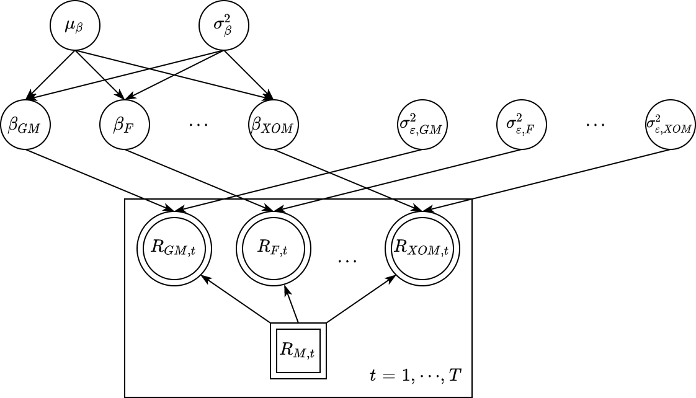

```{r, include=FALSE}
library(rjags)
library(corrplot)
```

## 1. Executive Summary

When making rational investment decisions, we need to formulate our expectations for future growth of stock prices, measured by expected returns (ignoring dividends)
$$R_t = \frac{P_t - P_{t-1}}{P_{t-1}}, \qquad E[R_t] = \frac{E[P_t] - P_{t-1}}{P_{t-1}}$$
where $P_t$ stands for stock price at time $t$; $R_t$ stands for stock return during period $t-1$ to $t$. Buying high-return stocks and getting rid of low-return stocks, we will end up with sound investment results.

The first well-kown attemp to tackle such return expectation problem dates back to [William F. Sharpe (1964)](https://onlinelibrary.wiley.com/doi/full/10.1111/j.1540-6261.1964.tb02865.x), where he postulates that individual stock return ($R_i$) can be explained by overall market return ($R_m$):
$$
E[R_j] = R_f + \beta_j (E[R_M] - R_f))
$$
The above formula is widely known as the Capital Asset Pricing Model (CAPM). Interested reader can further refer to [the Wikipedia page](https://en.wikipedia.org/wiki/Capital_asset_pricing_model). Even though Sharpe's model is widely cited and accepted as a solid banchmark for return expectation, it has many drawbacks (widely documentated in the literature, [link to an example](https://www.investopedia.com/articles/investing/021015/advantages-and-disadvantages-capm-model.asp)). In this project, let's tackle one of these problems: the randomness imbedded CAPM parameter $\beta$.

Traditional CAPM assumes that there is a (constant) true model parameter $\beta$ (frequentist point of view). However, intuition tells us that such $\beta$ is far from being a constant number. The relationship between individual stock return and overall market return during financial crisis is drastically different from their relationship during a bull market. Bayesian modeling can help us capture such uncertainty in $\beta$ by allowing it to be a random variable.

**Goal:** As a summary, in the following sections, we will try to improve Sharpe's CAPM model and tackle the expected stock return formulation problem from a Bayesian perspective.

**Conclusion:** ExxonMobil (XOM) has the highest expected return 5.7%, while Citigroup (C) has the lowest 3.2%.

## 2. Data Collection

```{r, echo=FALSE}
dat = read.csv("./datasets/Stock_Bond.csv")
cols = c("GM_AC","F_AC","UTX_AC","CAT_AC","MRK_AC","PFE_AC",
         "IBM_AC","MSFT_AC","C_AC","XOM_AC","S.P_AC")
price_ac = dat[4543:4794, cols]
tickers = c("GM","F","UTX","CAT","MRK","PFE",
            "IBM","MSFT","C","XOM","SP500")
colnames(price_ac) = tickers
str(price_ac)
```

Thanks to the electronification of financial markets, data is usually clean, tidy, and widely available. Example sources include: [Yahoo Finance](https://finance.yahoo.com/) and [Google Finance](https://www.google.com/finance). For our purposes, we need a collection of time series return data for different stocks. Here, I am using the data provided Professor David Ruppert and David S. Matteson from Cornell University. Such data set is publicly available through the following [link](https://people.orie.cornell.edu/davidr/SDAFE2/datasets.zip).

The above block shows summary statistics of adjusted daily closing prices of 10 stocks (GM, F, UTX etc.) and the market (S&P 500) in year 2005. After checking that: there is no outlier and missing value, we are ready to move on.

\newpage

## 3. Data Exploration

Given daily adjusted closing prices, we can calculate daily returns of each security:$R_{j,t} = \frac{P_{j,t} - P_{j,t-1}}{P_{j,t-1}}$

The following pair-wise correlation plot shows relationships between stock and market returns. We can observe (from the last column) that, strong linear relationships do exist between stock daily returns and market (S&P 500) daily returns, which justifies the linear model postulated in Sharpe (1964).

```{r, echo=FALSE, fig.width=5.6, fig.height=5.6, fig.align='center'}
n = dim(price_ac)[1]; m = dim(price_ac)[2]-1
r = price_ac[-1,]/price_ac[-n,] - 1
Cor = cor(r)
corrplot(Cor, type="upper", method="ellipse", tl.pos="d", tl.cex=0.7)
corrplot(Cor, type="lower", method="number", col="black",
         add=TRUE, diag=FALSE, tl.pos="n", cl.pos="n")
```

## 4. Model Postulation

### 4.1 Benchmark Model (OLS Regression)

The simplest estimation approach is to run 10 independent OLS regressions of each stock returns on the market returns. Estiamted coefficients are listed below.

```{r, echo=FALSE}
betas_ols = numeric(m)
for(i in 1:m)
{
  betas_ols[i] = coefficients(lm(r[,i] ~ r[,m+1]))[2]
}
names(betas_ols) = tickers[1:m]
round(betas_ols,4)
```

This approach, however, suffers from two main drawbacks: (1) as we mentioned before, $\beta_j$ is treated as a constant number, which is far from being true in reality. (2) each OLS regression is run independently from each other. When estimating coefficients for stock $i$, data for all the other stocks are thrown away, which is a great loss of information.

These two problems can be handled well in the following hierarchical Bayesian linear regression model.

\newpage

### 4.2 Bayesian Hierarchical Linear Regression



To make things easier, we assume the risk-free rate ($R_f$) is zero. Then, the stock return generating process becomes:
$$
R_{j,t}=\beta_j\cdot R_{M,t}+\epsilon_{j,t}\qquad j\in\{\text{GM},\text{F},\cdots,\text{XOM}\}
$$
$$
\epsilon_{j,t} \sim N(0,\sigma_{\epsilon,j}^2)\qquad \beta_j \sim N(\mu_\beta,\sigma_\beta^2)
$$
$$
\sigma_{\epsilon,j}^2 \sim \text{InvGamma}(0.1,0.001) \qquad \mu_\beta \sim N(1,10^6) \qquad \sigma_\beta^2 \sim \text{Uniform}(1,100)
$$
Here, we put a hierarchical structure on $\{\beta_j\}$: rather than fitting a linear model independently for each stock, we assume that $\{\beta_j\}$ come from a joint distribution. This choice (1) aligns with our intuition that each stock (as a small group) sits in the universe of all tradable assets, and (2) accounts for the relationships between return data from different stocks.

## 5. Model Fitting

```{r}
bayesian_capm = "model
{
  for(t in 1:N)
  {
    for(j in 1:m)
    {
      R[t,j] ~ dnorm(beta[j]*mkt[t], tau_e[j])
    }
  }
  for(j in 1:m)
  {
    beta[j] ~ dnorm(mean_b, tau_b)
    tau_e[j] ~ dgamma(0.1, 0.001)
  }
  mean_b ~ dnorm(1, 1e-6)
  tau_b ~ dunif(1, 100)
}"
```

With the above model string, we can use `JAGS` to fit our Bayesian Capital Asset Pricing Model.

```{r, include=FALSE}
set.seed(42)

data = list(R=r[,1:m], N=dim(r)[1], mkt=r$SP500, m=m)

params = c("beta")
inits_capm = function() { list(beta=rep(1,m)) }

jags_capm = jags.model(
  textConnection(bayesian_capm),
  inits=inits_capm, data=data, n.chains=3
)
update(jags_capm, 1e3)

capm_sim = coda.samples(
  model=jags_capm,
  variable.names=params,
  n.iter=5e3
)

capm_csim = as.mcmc(do.call(rbind, capm_sim))
```

\newpage

## 6. Model Checking

```{r, include=FALSE}
plot(capm_sim)
gelman.diag(capm_sim)
autocorr.diag(capm_sim)
effectiveSize(capm_sim)
```

Trace plots and Gelman diagnostics show that the burn-in period is sufficiently long and the underlying Markov chains reach stationarity. No significant auto-correlation is found and the effective same sizes are all at the level of thousands, which shows that our posterior estimations are fairly accurate.

```{r, echo=FALSE, fig.width=6.4, fig.height=3.5, fig.align='center'}
betas = colMeans(capm_csim)
rhat = matrix(r$SP500, ncol=1) %*% betas
resid = r - rhat
plot(rhat[,10], resid[,10], main=colnames(r)[10])
```

Residual plots also look reasonably good (above is an example for XOM), which shows that our models assumptions approximate the reality well.

## 7. Model Usage

```{r, echo=FALSE}
res_betas = t(round(summary(capm_sim)[[1]],4)[,1:2])
colnames(res_betas) = tickers[1:m]
res_betas
```

Given the above estimations for $\beta_j$, we can formulate rational estimations for expected stock returns.
$$
E[R_j] = \beta_j \cdot E[R_M]
$$

```{r, echo=FALSE}
res_ret = colMeans(rhat)
names(res_ret) = tickers[1:m]
round(res_ret * 252, 5)
```

Caveats for our Bayesian Capital Asset Pricing Model: (1) here, we did not consider uncertainties in risk-free rates ($R_f$). In practice, $R_f$ is affected by the monetary policy of central banks and should not be ignored. (2) CAPM is a single-factor model, which only considers market risk $R_M$. The real world is much more complicated than this simple model and investors should take more factors into considerations.

## References

- Ruppert, David. Statistics and data analysis for financial engineering. Vol. 13. New York: Springer, 2011.
- Sharpe, William F. "Capital asset prices: A theory of market equilibrium under conditions of risk." The journal of finance 19, no. 3 (1964): 425-442.
